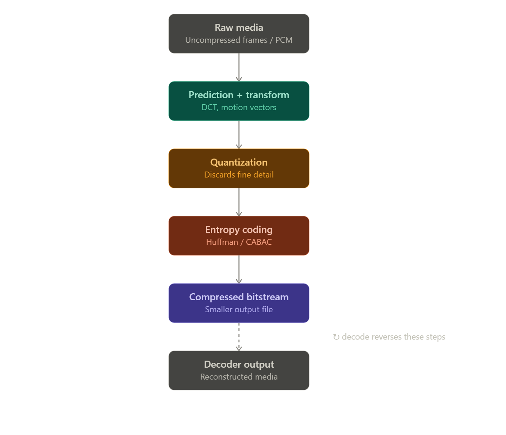

# Volt

Volt is a fast, quality-focused media optimization CLI built in Rust.

It is designed to reduce the size of video and audio files while keeping quality loss as low as possible. Speed is a core priority, with support for hardware acceleration planned where available.

Volt aims to provide sensible defaults for people who want smaller media files without having to understand every encoding option.

## How it works

Volt analyzes the input media, chooses an appropriate codec and encoding strategy, then writes an optimized media file that remains compatible with standard media players.





## Compression trade-offs

Volt aims for the best balance between speed, file size, and visual quality.

```text
                    Better compression
                           ▲
                           │
                           │
                Quality ───┼─── Size
                           │
                           │
                           ▼
                        Faster
```

Increasing compression usually reduces file size, but it can require more processing time or introduce some quality loss. Volt's default mode is intended to stay near the best balance between these trade-offs.

## Codec choices

Different codecs prioritize different goals.

| Codec        | Encoding Speed | File Size | Compatibility |
| ------------ | -------------- | --------- | ------------- |
| H.264        | Very fast      | Good      | Excellent     |
| H.265 / HEVC | Fast           | Better    | Good          |
| AV1          | Slower         | Excellent | Growing       |
| AAC          | Very fast      | Good      | Excellent     |
| Opus         | Fast           | Excellent | Good          |

Volt can use different codecs depending on the input media, selected mode, and available hardware acceleration.

## Goals

* Fast media processing
* Good quality at smaller file sizes
* Simple command-line interface
* Hardware acceleration where available
* Support for common video and audio formats
* Batch processing
* Useful progress and output information

## Supported Media

Volt is intended to support a range of media formats, including common video and audio containers and codecs. Support will expand as development progresses.

## Status

Volt is currently in early development.

The initial focus is on building the core media processing pipeline and a clean command-line experience.

## License

License information will be added as the project develops.
